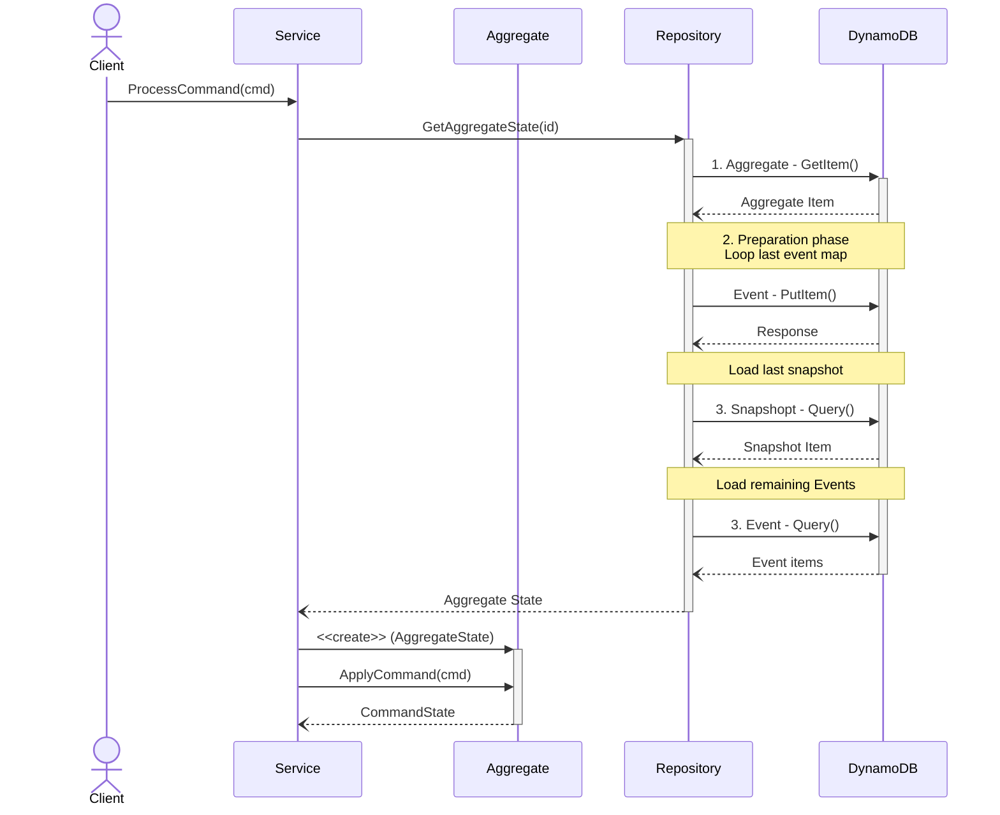

# Special Broccoli - A Financial Serverless API

This application is a CQRS oriented serverless application.

This application was born to can deep knowledge about CQRS, serverless and Event Sourcing.

---

# Summary

- [Requirements](#requirements)
- [Running](#running)
- [About](#about)
- [Resources](#resources)
- [Additional Content](#additional-content)

# Requirements

To be able to execute this application, you should have installed in your PC the following:

- [Docker](https://docs.docker.com/engine/install/ubuntu/)
- [Docker-Compose](https://docs.docker.com/compose/install/other/)
- [Go](https://go.dev/doc/install)
	- Alternative to Arch Linux. [Shell install](https://gist.github.com/jeanmolossi/8f2a643540aee671becf828d983952fd)
- [Sam CLI](https://docs.aws.amazon.com/serverless-application-model/latest/developerguide/install-sam-cli.html)

# Running

To run this application, ==you should run all== following commands:

- Shell.1 - `make start`
	- It will build application and prepare local APIGateway to perform requests
- Shell.2 - `make run`
	- It will enable development hot-reload in `.go$` files

# About

This application was born to can deep knowledge about CQRS and serverless.

To build this application we use a lot of tools:

- Go workspaces (requires go >= 1.19)
- [APIGateway V2](https://docs.aws.amazon.com/apigateway/?icmpid=docs_homepage_networking)
- [DynamoDB](https://docs.aws.amazon.com/dynamodb/?icmpid=docs_homepage_featuredsvcs)
- [Lambda Functions](https://docs.aws.amazon.com/lambda/?icmpid=docs_homepage_featuredsvcs)

### Load Aggregate

# Resources

| Path				| Method 		| Description					|
| :----------------	| :------------	| :----------------------------	|
| /accounts 		| **POST**		| Create User Account to Manage Wallets And Transactions |
<!-- | /accounts 		| POST			| Create User Account to Manage Wallets And Transactions | -->

# Additional Content

- [Learn more about CQRS](https://martinfowler.com/bliki/CQRS.html)
- [CQRS Serverless application](https://aws.amazon.com/pt/blogs/database/build-a-cqrs-event-store-with-amazon-dynamodb/)
